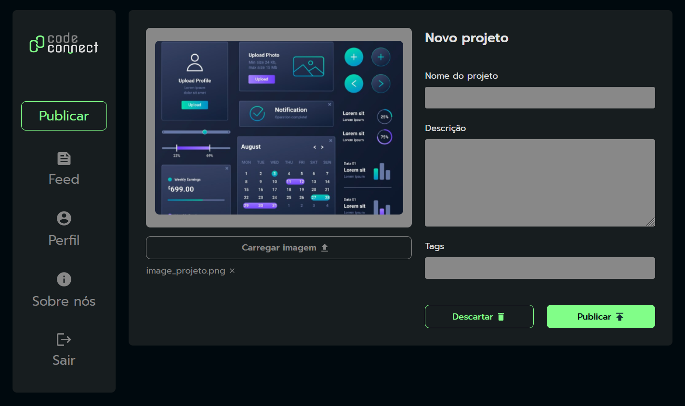

## 🌐 Code Connect

O **Code Connect** é um espaço para que as pessoas possam publicar **projetos de tecnologia**, adicionando **nome, imagem, descrição e tags**. Ele foi desenvolvido para praticar **JavaScript assíncrono**, explorando conceitos como **Promises, async/await e Event Loop**. A aplicação permite gerenciar **tarefas assíncronas, manipular retornos de funções assíncronas e tratar erros** de forma eficiente, oferecendo uma experiência prática na construção de aplicações modernas em JavaScript.

 

## 🚀 Sobre o Projeto

Este projeto foi desenvolvido durante o curso da Alura:

* "JavaScript: entendendo promises e async/await"
  
O **Code Connect** simula uma aplicação real de compartilhamento de ideias, permitindo organizar e exibir projetos de maneira clara e dinâmica. O projeto tem como objetivo aprofundar o conhecimento em **tarefas assíncronas em JavaScript**, permitindo que os desenvolvedores criem **funções assíncronas, utilizem Promises para lidar com retornos futuros e entendam o fluxo do Event Loop**. A aplicação também explora **setTimeout** e técnicas de **tratamento de erros**, proporcionando um aprendizado sólido sobre como organizar e controlar código assíncrono.

## 📚 Objetivos do Curso

* Aprender a gerenciar **tarefas assíncronas com JavaScript**;
* Construir **funções assíncronas com async/await**;
* Lidar com **retornos** de funções assíncronas com auxílio das **Promises**;
* Implementar **setTimeout** para executar código assíncrono em momentos específicos;
* Compreender técnicas para **tratamento de erros** em aplicações JavaScript;
* Conhecer sobre o funcionamento do **Event Loop, Call Stack e Task Queue**.

## 🛠️ Tecnologias Utilizadas

## 🖼️ Visualização do Projeto

Uma prévia das principais funcionalidades do **CodeConnect**:

**🌐 Acesse o Projeto Online**

O projeto está disponível para visualização na **Vercel**. Clique no link abaixo para acessar:

**📨 Página do Projeto**

Página inicial onde as pessoas podem publicar seus projetos, adicionando nome, imagem, descrição e tags.

